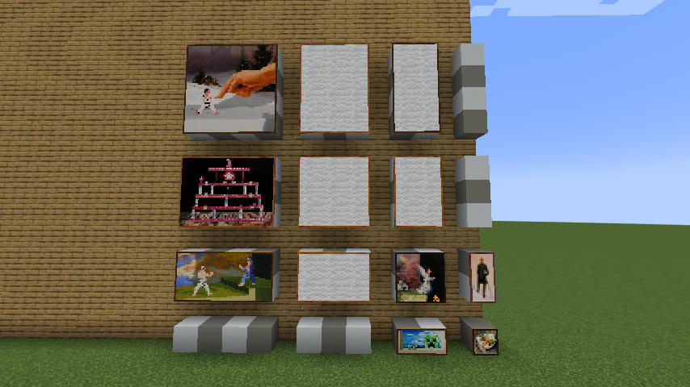

# More Canvases

Intended to be used together with the [Client-Paintings](https://github.com/enjarai/client-paintings) mods.

This mod adds blank paintings in sizes otherwise unavailable, enabling 
the use of these sizes in Client-Paintings resource packs.




The mods generates all size within the bounds defined in the config files in `.minecraft/config/More-Canvases.properties`:
```java
width.min=1
width.max=4
height.min=1
height.max=4
```

Generated paintings won't be placeable by default; and need to be enabled via datapacks, by adding them to [/data/minecraft/tags/painting_variant/placeable.json](./src/main/resources/data/minecraft/tags/painting_variant/placeable.json).
The sizes 3:4, 2:4, 3:3, 2:3, and 3:2 (seen above) are placeable by default and don't require a datapack.

Blank paintings still have a chance to turn up when using Client-Painting, unless [their textures](./src/main/resources/assets/mocan/textures/painting/) are also modified by a resource pack. Each size is associated with the corresponding filename `blank{WIDTH}x{HEIGHT}.png`, where `{WIDTH}` and `{HEIGHT}` are measured in blocks.
Most generated paintings will have a missing texture. This won't be worked on, since those paintings are intended to be replaced through a resource pack.

##	Versions

- Minecraft 1.19.4
- Fabric Loader 0.14.19 or above
- Fabric API 0.79.0 or above
