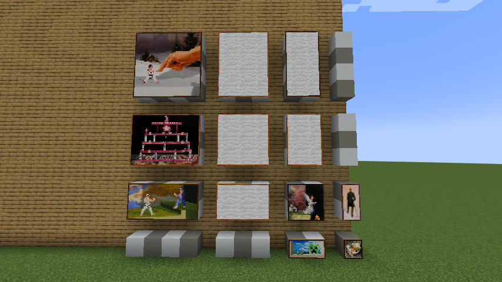

# More Canvases

Intended to be used together with the [Client Paintings](https://github.com/enjarai/client-paintings) mods.  
This mod ads a few blank paintings in sizes usually unavailable, enabling the use of these sizes in Client Paintings resource packs.

By default, only the sizes shown above placeable: 3:4, 2:4, 3:3, 2:3, and 3:2. However all sizes up to 4x4 are built-in, and can be enabled through the use of a datapack, by adding to [painting_variant/placeable.json](./src/main/resources/data/minecraft/tags/painting_variant/placeable.json)

Blank paintings still have a chance to turn up, unless [their textures](./src/main/resources/assets/mocan/textures/painting/) are also modified by a resource pack.

##	Versions

- Minecraft 1.19.4
- Fabric Loader 0.14.19 or above
